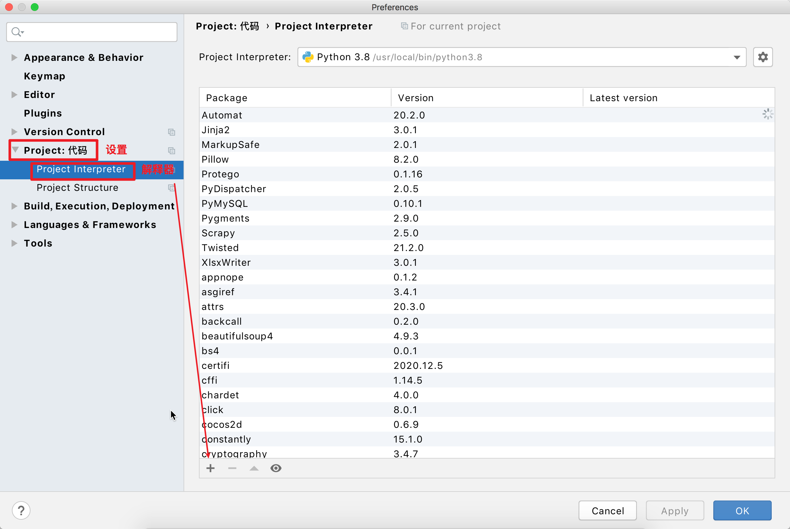
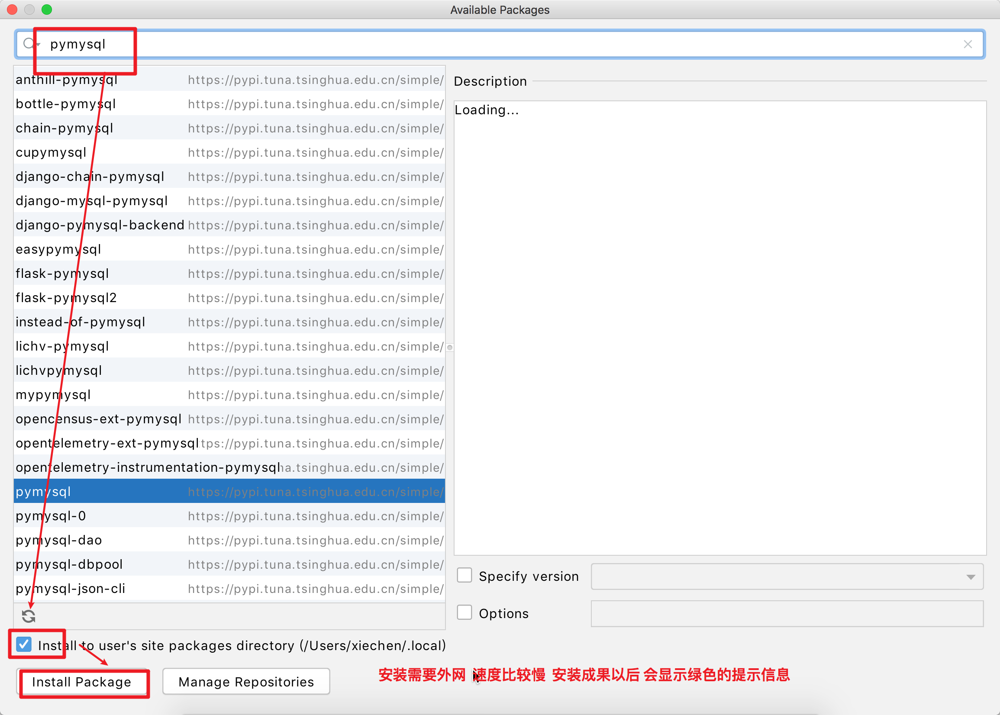
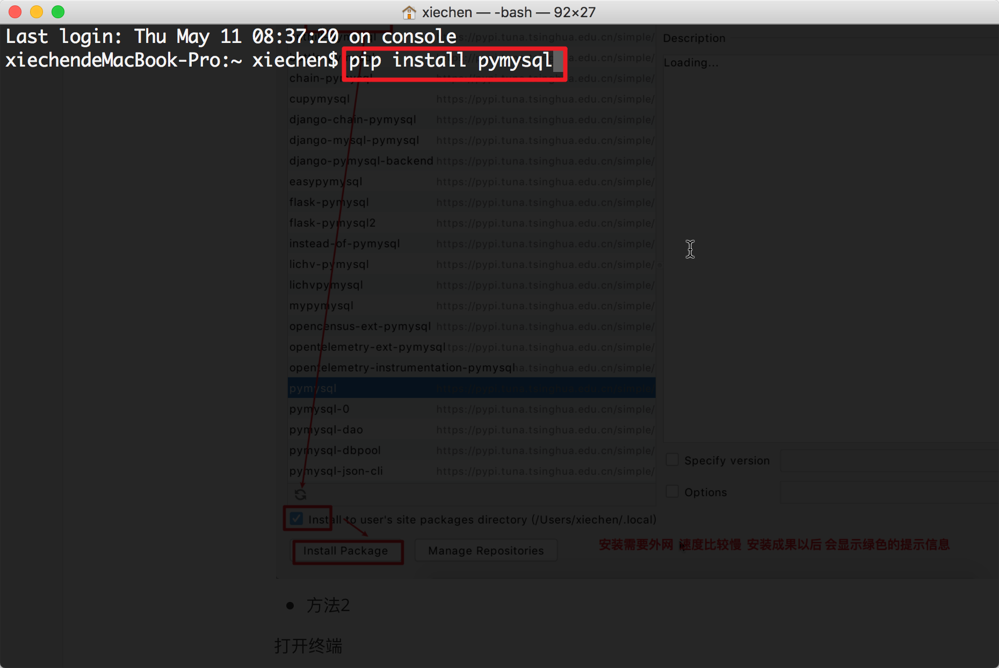
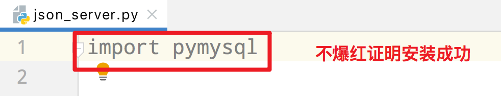

## day02

#### 01-今日思路

- 需求1 : 把json文件(订单信息) 存储到 数仓/csv备份
  - 步骤
    - 日志功能实现了
    - 获取了所有的json文件的绝对路径
      - 问题: 希望每次不去处理 已经处理过的文件!!!
      - 解决: 把所有的处理过的文件名存储到数据库里(metadata)
        - 从metadata元数据库中 获取 处理过的文件名
        - 获取全部的json文件的名字
        - 以上进行对比 获取 没有处理过的文件名
- 今天目标
  - 从metadata元数据库中 获取 处理过的文件名
    - 在python中使用数据库  pymysql
    - 不pymysql相关的数据库操作 封装成一个mysql数据库 工具
  - 获取 没有处理过的文件名
    - 实现一个方法 获取处理过的文件名
    - 实现一个方法  对比所有的文件名 和 处理过的文件名 进而获取没有处理过的文件


模块安装:

- 方法1





- 方法2

打开终端




- 安装成功




#### 02-python数据操作

- 执行步骤


- sql执行的分类

  - 查询的sql语句

    - cur.execute(sql)
    - data = cur.fachall()
      - data数据类型 : ((),(),()) 

  - 增删改的sql语句

    - 如果增删改需要进行数据的提交 

      ```python
      # 手动数据提交
      conn.commit()
      ```

    - 如果不想手动提交

      ```python
      # 创建链接
      conn = pymysql.connect(
          host='127.0.0.1',
          port=3306,
          user='root',
          password='chuanzhi',
          charset='utf8',
          autocommit=True
      )
      ```

  - 查询代码

  ```python
  import pymysql
  
  # 1. 建立链接(桥)
  conn = pymysql.connect(
      host='127.0.0.1',
      port=3306,
      user='root',
      password='chuanzhi',
      charset='utf8'
  )
  # 选择数据库
  conn.select_db("zhengzhou")
  # 2. 创建游标(小弟)
  # 游标: 记录数据读取位置
  cur = conn.cursor()
  # 3. 游标执行sql语句
  sql = "select * from goods;"
  # 小弟执行slq
  cur.execute(sql)
  # 4. 获取查询到的数据(卸货)
  # fetchall(): 获取所有的数据
  # data类型 ==> ((),(),())
  data = cur.fetchall()
  for i in data:
      # i:是一个元组 同时是一条数据
      print(i)
  # 5. 关闭
  cur.close()
  conn.close()
  ```

  - 增删改代码

  ```python
  import pymysql
  # 创建链接
  conn = pymysql.connect(
      host='127.0.0.1',
      port=3306,
      user='root',
      password='chuanzhi',
      charset='utf8',
      autocommit=False
  )
  # 选择数据库
  conn.select_db("zhengzhou")
  # 创建游标
  cur = conn.cursor()
  # 执行sql
  sql = "update goods set cate_name='yyy' where id=1;"
  cur.execute(sql)
  # 修改后进行查询
  sql = "select * from goods;"
  cur.execute(sql)
  # 获取数据(卸货)
  # 数据类型: ((),(),())
  for i in cur.fetchall():
      print(i)
  # 手动数据提交
  conn.commit()
  # 关闭连接
  cur.close()
  conn.close()
  ```


#### 03-封装数据库工具

- 数据库工具类
  - 创建MySQL的连接(init方法)
  - 关闭连接(close_conn方法)
  - 选择数据库，就是SQL中的use功能(select_db方法)
  - 执行指定的SQL语句查询，并返回查询结果(SELECT)__ (query方法)
  - 执行一条单独的无返回值的SQL语句并自动commit（CREATE、UPDATE)__(execute方法)
  - 执行一条单独的无返回值的SQL语句不会自动commit（CREATE、UPDATE)__(execute_without_autocommit)
  - 查看表是否存在(check_table_exists)
  - 查看表是否存在并创建表(check_table_exists_and_create)